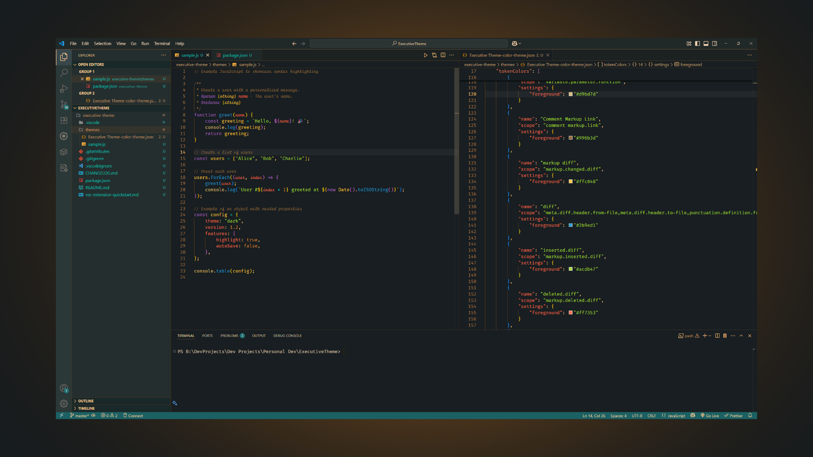

# Executive

## A luxurious color theme for devs with crown moulding. Deep jade greens, rich brown accents, and a touch of refined taste.

---

---

### Installation

1. Search for Executive Theme in the Extensions sidebar in VS Code.
2. Click Install to add it to your editor.
3. Open the Command Palette and run Preferences: Color Theme.
4. Select Executive from the list to activate.
